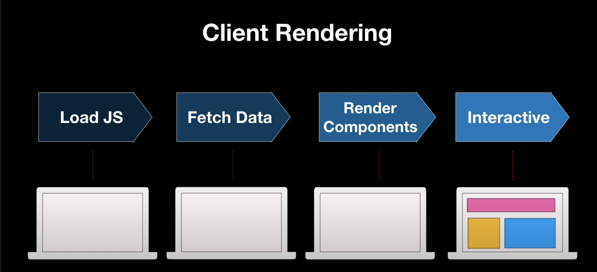
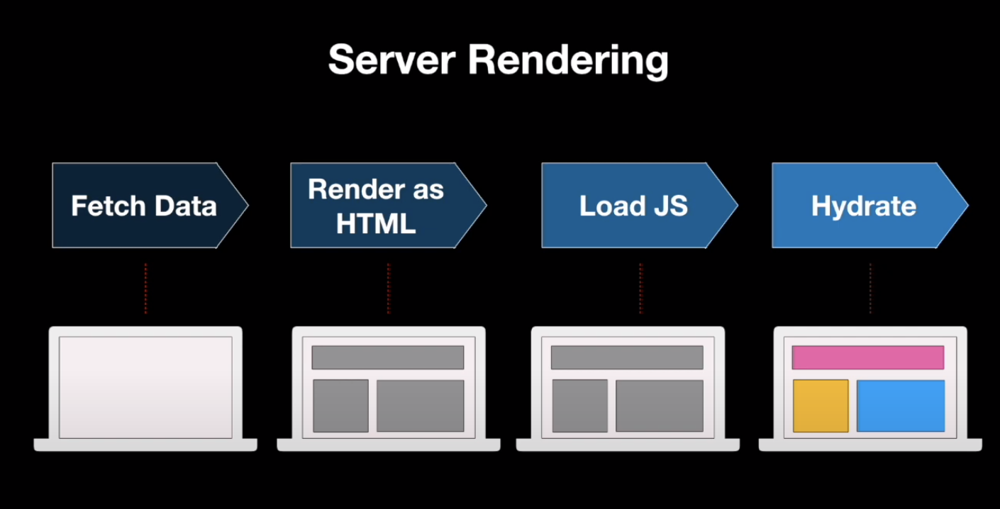

# React 18 Demo - Upgrade Notes

## Upgrade to React 18

Upgrade has been made easy since React 17, so minimal changes to the application needed to upgrade (could be done in an afternoon).

Start by updating packages to latest version:

```
npm install react@rc react-dom@rc
```

Check the [latest available version on NPM,](https://www.npmjs.com/package/react) as a new version could have been released.

## React 18 Features

### Root API

-   Shipped with the Legacy Root API and the new Root API with `ReactDOM.createRoot`.
-   Remove the `ReactDOM.hydrate` method and move hydration config to the top-level component.
-   `ReactDOM.render` of the new Root API does not support the second callback argument. To execute a side effect after rendering, declare it in a component body with `useEffect()`.
-   Include improvements "out of the box" and allow concurrent mode features.

### Strict Mode (with Strict Effect)

-   Shipped with Strict Effect mode directly in `<StrictMode />`.
-   Will double-invokes effects _(e.g.: mount → unmount → mount)_ for newly mounted components:
    -   So, will now double console log Strict Mode.
    -   help to better detect unusual side effects/behaviour/pattern (e.g `useEffect` mounting and cleanup functions).
-   Will only work for development builds to improve DX (Developer Experience).

### Automatic Batching

-   Batch state update into a single render, even for asynchronous call.
-   Prevent the components from rendering “half-finished” states where only one state variable was updated.
-   Better computational performance.
-   Works for `setTimeout`, `Promise`, native events handlers and other functions-event like.

**Reminder:** With React 17, we could batch states change into a single render ONLY if the update was made in a synchronous-way. Hooks like `useCallback` and `useMemo` was a workaround to single render update for asynchronous call.

### Suspense (with Streaming HTML & Selective Hydration)

-   `<Suspense />` allow you to break down the React App on smaller chunks:
    -   Reduce initial bundle size.
    -   Overhaul improvements for SSR on the first loading screen time.
-   **Selective Hydration** for one or multiples components:
    -   Components that are wrapped with `<Suspense />` will not block hydration of the page or other components anymore.
    -   Start hydrating once the browser gets both its content and JavaScript code.
    -   Use fallback to identify area that will be replaced by ready to interact components.
-   **Streaming HTML** help to prioritize interactive components (only perceptible for extreme slow connection):
    -   If one suspended component has been clicked while it's still loading, React will immediately stop what it is doing elsewhere and prioritize the loading of that component.
    -   Decides which parts of the application might take longer to load and what shall be rendered directly.

**Reminder:** With React 17, we needed to charge the entire page before it could start hydrating components.

### Transition - startTransition() and useTransition()

-   Can be use wherever network calls or render-blocking processes are present.

-   Helps to keep the current webpage responsive and being able to do heavy non-blocking UI updates at the same time.
-   Allows to differentiate between quick updates and delayed updates:
    -   Quick update (urgent): `setText(input)`
    -   Delayed update (non-urgent): `startTransition(() => { setText(input); });`
-   Avoid to use `debounce` and we don't need to play with timer.
-   Optimize usage of memory for rendering time.
    -   See an [example of startTransition impact on performance made by Swizec](https://react-fractals-git-react-18-swizec.vercel.app/).
-   `useTransition` allow to show a loader whild transition is pending. It help to indicate app is still processing their imput.

**Example:** A user starts typing in a search box. The input value has to be immediately updated while the search results could wait few milliseconds (as expected by the user).

### Refine APIs

#### useId()

- Generating a single and unique IDs on both the client and server rendering (on hydration mode) and outside of server-rendered content, it falls back to a global counter ID.
- Help to support accessibility (since these APIs are heavily based on unique IDs to link components together).

**Reminder:** With React 17, we used to generate IDs wherever needed using `Math.random()`. However, server-side rendering makes it complicated due to ID mismatch between client and server.


#### useDeferredvalue()

-   Allow a state part that take more time to process without blocking the rendering.
    -   Ex: A sort/filter button that update the state of a large list.
    -   Ex: A text input field that can be immediately rendered to the screen, but a component that take a `useDeferredValue` and returns a `defferedText` which lags by 3 seconds. This results in delaying the Card Lists component while still allowing users to have the text field feel snappy.

#### useSyncExternalStore()

-   New API for `useMutableSource()`.
- Mainly use by library (so no need to dive in).

## Concepts

### Concurrent Features (aka Concurrency)

Concurrent Mode is gone! Now it's Concurrent Features for a better performance experience !

-   Execute multiple tasks simultaneously: consider that an animation is playing in a component, and at the same time a user is able to click or type in other React components.
-   Combine, reorder and prioritize events and functions in the single threaded process.
-   Control invocation order to give some control to the user via the Transition API.
-   Concurrent Feature include:
    -   Root API: `createRoot` to enable new concurrency features supports.
    -   Transition API: `startTransition` to specity priority of rendering.
    -   Suspense API: `<Suspense />` to streaming server render and selective hydration.

### SSR Adoption plan

A little reminder on how SSR (Server-Side Rendering) works:

-   On the client side:
    - Browser receives a request for a page.
    - Server sends HTML, CSS and, JS code to the browser.
    - Client load script and render React App.
    - Client fetch datas.
    - React App becomes interactive.
-   On the server side:
    - Browser receives a request for a page.
    - Server fetch datas for the entire application.
    - Server render all React components to HTML.
    - Server send HTML to the browser.
    - Users can see the content of the React App.




During the React Conf 2021, the React teams shared their vision for Suspense and Server Components adoption for the next versions for better SSR support (_work in progress_):


